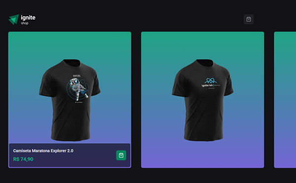
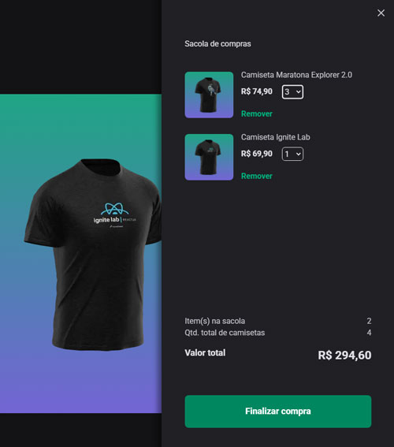
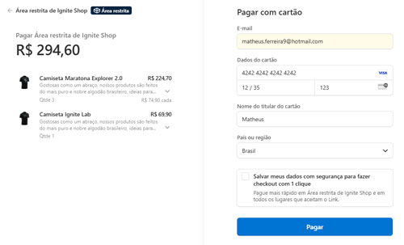
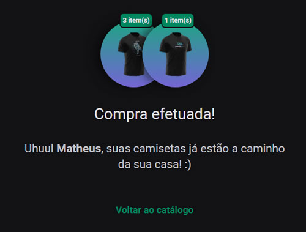

# Stripe Shop

Projeto desenvolvido a partir do curso Formação React da Rocketseat.
O sistema tem como objetivo simular um **shop de compras de camisetas**, desenvolvido com **Next** utilizando a **API do Stripe** para pagamentos.

O sistema contém um **carrinho de compras**, onde o usuário poderá adicionar mais de uma camiseta, selecionar quantidade, visualizar somatório e finalizar a compra.

#### Home

#### Carrinho/sacola de compras

#### Área de pagamentos na Stripe

#### Redirecinamento de sucesso, ao finalizar compra

### Tecnologias utilizadas

- **NextJS** - framework React
- **Stripe** - API para pagamentos
- **Stitches** - estilização
- **Tailwindcss** em conjunto do **ShadCN**
- **Axios** - requisições HTTP
- **Keen Slider** - slide para apresentação das camisetas

### Como testar o projeto

1. No terminal, execute: **git clone https://github.com/iammatheus/stripe-shop.git**

2. Abra a pasta do projeto e no terminal digite: **npm i** ou **pnpm i** para instalar as dependências
3. Crie na raíz do projeto um arquivo chamado **.env.local** seguindo exemplo do arquivo **.env.example**
4. Você precisará ter uma conta no **Stripe**, cadastrar alguns produtos e obter as chaves **pública** e **secreta**, colocando elas no arquivo criado
5. Execute no terminal: **pnpm run dev** para rodar o projeto
